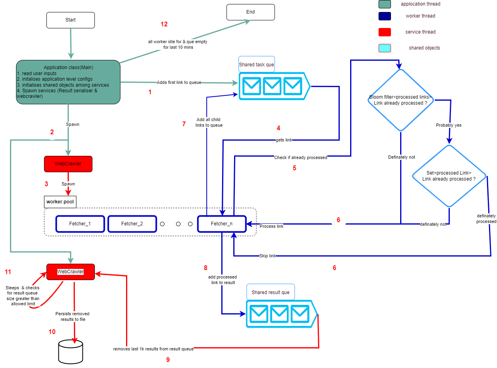
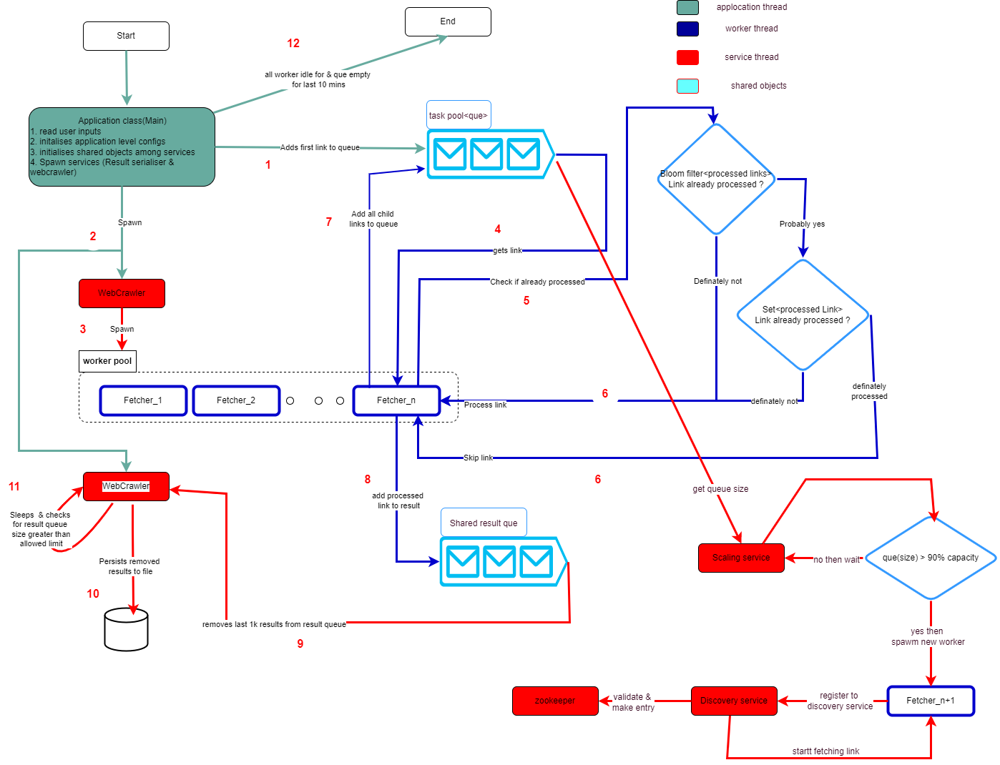

About the Project :
=====
This projects implements a webcrawler to create pagerank within given dommain.

The crawling process
=====
Given a root URL and depth limit the crawler starts the crawling by fetching the
page at the root URL and processing it. The processing of the page is basically
composed of 2 tasks:
1. Calculating the page rank (more on that in the next section).
2. Crawling (fetching and processing) its statically linked pages until the depth
   limit is reached.

Calculating the page rank
=====
For each page, calculate the ratio of same-domain links that it contains, as a number
in [0, 1].
For example, say the page at https://www.foo.com/bar.html contains the
following links:
1. http://www.foo.com/a.html
2. http://www.foo.com/b/c.html
3. http://baz.foo.com/
4. http://www.google.com/bar.html
   Then the ratio will be 0.5, since links 1 and 2 are same-domain links and the rest are
   not.
   Note: same-domain links must have the exact same host name, including subdomains.
   This means http://foo.com , http://bar.foo.com and
   http://baz.foo.com are three different domains links. Beside the host name all
   other parts of the URL including the protocol, port, path, query parameters etc. should
   be ignored for that matter.

Webcrawler local mode :
=====

Webcrawler distributed mode :
=====

Sample crawling :
=====
[Wikipedia page rank](src/main/resources/en.wikipedia.com.csv)

[Amazon UK page rank](src/main/resources/www.amazon.co.uk.csv)

Assumptions :
=====
1. it will fetch only http and https links. As mentioned in requirement domains like "en.wikipedia.com" and "wikipedia.com" are considered different domain.
2. redirections and non static content are not handled. These are crawler feature and needs lot of validation, since it was out of scope of this, havent implemented it.

TODOs :
=====
Added TODO comment in code for same.
1. factory class is not added to few interfaces (), this can be added to create particular instance based on config. classes are "Link" & "Output"
2. Main application class must send singnal to service classes before terminating for safe exit of child threads, this is not handle currently due to time constraint.
3. Input command line parser is not added
4. unit tests are not added.

Important classes :
=====
Main.java => Its an application class, which initalises all services, shared objects between classes(shared tasks que, shared result set) and initalises application w.r.t. input and config.ini
WebCrawler.java => its a service runs under main application. This service creates a worker thread pool and intialises all worker threads for crawling and waits for them to complete.
Fetcher => Its worker thread runs for WebCrawler service, its picks up one taks from task que, fetch html content for the link in task, compute its rank and add all of links(child links) present in content in a task queue as next set of tasks to be picked by other workers.
PageRankPolicy & CrawlingPolicy => these are interfaces t o decide which policies needs to be used for computing rank of page and kind of contents to be crawled.
PersistService => This is an service class that runs under MAin application, it decides how and when to persist result set. It polls queue for resultset every 5 mins and fetch first 1k resultset if result set size is increasing and seralises it in file. This ensures that it doesnt have to wait till end of processing and then dump resultset.
FileOutput => This class dumps result set to file.

Important data structures :
=====
BloomFilter<String> filter => bloom filter to verify if current link is definately not proessed
Set<String> visitedURLs => set to verify if current link is definately processed. With this filter we can avoid using bloom filter but with bloom filter as first filter we ensure that in most of the cases(99.99%) we avoid validating using this hashmap, since this check is costly and can be bottle neck in validation for worker which in turn becomes slow and can cause increase in task que's size gradually nearing to capacity.
List<Pair<Integer, Link>> processedLink => set of link processed, workers keeps on adding result to this, persist service keeps on removing results from this.
BlockingQueue<Pair<Integer,Link>> queue => task que for each link to be crawled.

TODOs :
=====
1. Implement distributed mode.
2. Handle 404 for crawling disabled pages
3. Handle CSS

Dependencies versions :
=====

java -version (OpenJDK java 16 <16.0.2>)
mvn --version (Apache Maven 3.8.2)

Build the project :
=====

mvn clean package
mvn clean install

Build java doc :
=====

mvn javadoc:javadoc

java doc location : <home_dir>/javadocs/WebCrawler/index.html

Run the Project :
=====
java -cp .\target\WebCrawler-1.0-SNAPSHOT-jar-with-dependencies.jar com.ankit.web.crawler.Main http://en.wikipedia.com 2
java -cp .\target\WebCrawler-1.0-SNAPSHOT-jar-with-dependencies.jar com.ankit.web.crawler.Main http://www.amazon.co.uk 2

Result location :
=====
resources/<link_host>

Config file :
=====
resources/config.ini
Note : Please read Constants.java file or its java doc for parameter descriptions.